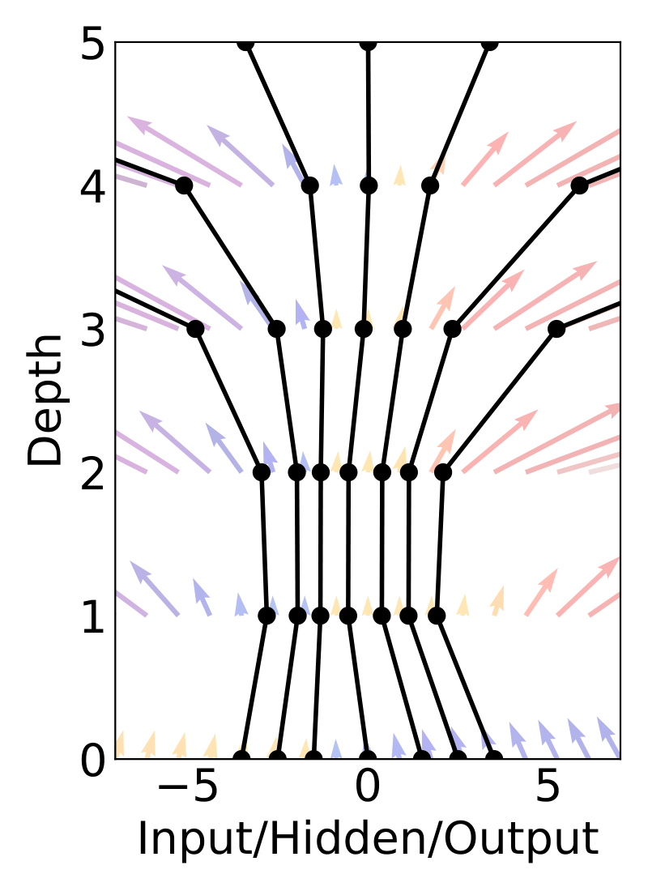
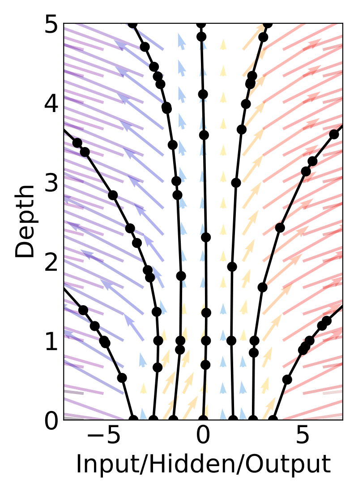
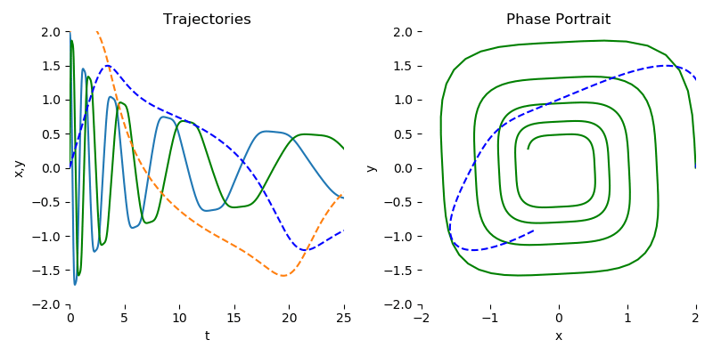

# PyTorch Implementation of Differentiable ODE Solvers

This library provides ordinary differential equation (ODE) solvers implemented in PyTorch. Backpropagation through all solvers is supported using the adjoint method. For usage of ODE solvers in deep learning applications, see [1].

As the solvers are implemented in PyTorch, algorithms in this repository are fully supported to run on the GPU.

---

<p align="center">
  
  
</p>

## Installation
```
pip install torchdiffeq
```

## Examples
Examples are placed in the [`examples`](./examples) directory.

We encourage those who are interested in using this library to take a look at [`examples/ode_demo.py`](./examples/ode_demo.py) for understanding how to use `torchdiffeq` to fit a simple spiral ODE.

<p align="center">

</p>

## Basic usage
This library provides one main interface `odeint` which contains general-purpose algorithms for solving initial value problems (IVP), with gradients implemented for all main arguments. An initial value problem consists of an ODE and an initial value,
```
dy/dt = f(t, y)    y(t_0) = y_0.
```
The goal of an ODE solver is to find a continuous trajectory satisfying the ODE that passes through the initial condition.

To solve an IVP using the default solver:
```
from torchdiffeq import odeint

odeint(func, y0, t)
```
where `func` is any callable implementing the ordinary differential equation `f(t, x)`, `y0` is an _any_-D Tensor representing the initial values, and `t` is a 1-D Tensor containing the evaluation points. The initial time is taken to be `t[0]`.

Backpropagation through `odeint` goes through the internals of the solver. Note that this is not numerically stable for all solvers (but should probably be fine with the default `dopri5` method). Instead, we encourage the use of the adjoint method explained in [1], which will allow solving with as many steps as necessary due to O(1) memory usage.

To use the adjoint method:
```
from torchdiffeq import odeint_adjoint as odeint

odeint(func, y0, t)
```
`odeint_adjoint` simply wraps around `odeint`, but will use only O(1) memory in exchange for solving an adjoint ODE in the backward call.

The biggest **gotcha** is that `func` must be a `nn.Module` when using the adjoint method. This is used to collect parameters of the differential equation.

### Keyword Arguments
 - `rtol` Relative tolerance.
 - `atol` Absolute tolerance.
 - `method` One of the solvers listed below.
 - `options` A dictionary of solver-specific options, see the [further documentation](FURTHER_DOCUMENTATION.md).

#### List of ODE Solvers:

Adaptive-step:
 - `dopri8` Runge-Kutta 7(8) of Dormand-Prince-Shampine
 - `dopri5` Runge-Kutta 4(5) of Dormand-Prince **[default]**.
 - `bosh3` Runge-Kutta 2(3) of Bogacki-Shampine
 - `adaptive_heun` Runge-Kutta 1(2)

Fixed-step:
 - `euler` Euler method.
 - `midpoint` Midpoint method.
 - `rk4` Fourth-order Runge-Kutta with 3/8 rule.
 - `explicit_adams` Explicit Adams-Bashforth.
 - `implicit_adams` Implicit Adams-Bashforth-Moulton.
 
For most problems, good choices are the default `dopri5`, or to use `rk4` with `options=dict(step_size=...)` set appropriately small. Adjusting the tolerances (adaptive solvers) or step size (fixed solvers), will allow for trade-offs between speed and accuracy.

#### Frequently Asked Questions
Take a look at our [FAQ](FAQ.md) for frequently asked questions.

#### Further documentation
For details of the adjoint-specific and solver-specific options, check out the [further documentation](FURTHER_DOCUMENTATION.md).

### References
[1] Ricky T. Q. Chen, Yulia Rubanova, Jesse Bettencourt, David Duvenaud. "Neural Ordinary Differential Equations." *Advances in Neural Information Processing Systems.* 2018. [[arxiv]](https://arxiv.org/abs/1806.07366)

---

If you found this library useful in your research, please consider citing
```
@article{chen2018neural,
  title={Neural Ordinary Differential Equations},
  author={Chen, Ricky T. Q. and Rubanova, Yulia and Bettencourt, Jesse and Duvenaud, David},
  journal={Advances in Neural Information Processing Systems},
  year={2018}
}
```
